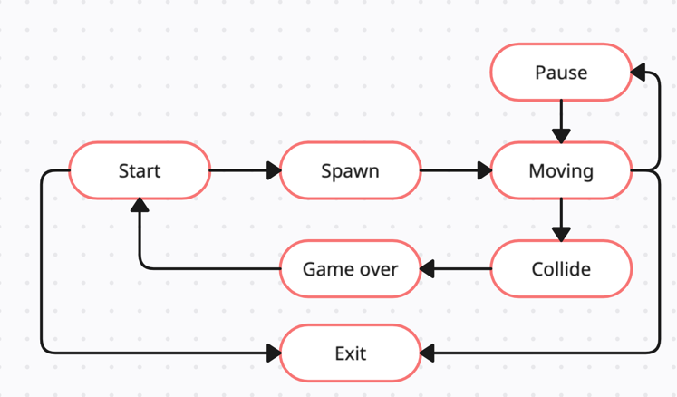

### Car Racing Game
This repository contains Car Racing Game Package in Go.
The game replicates a classic arcade-style racing experience, 
where the player must avoid rival cars and stay on track while advancing lanes.

Features
- Rival cars: Rival cars spawn and move downward on the track.
- Collision detection: Collisions with rival cars result in game over.
- FSM-based logic: The game state is controlled using a finite-state machine, making it easy to manage transitions such as starting the game, moving, pausing, and game-over.
```go
package main

import (
	"github.com/arseniisemenow/race"
)

func main() {
	game := race.NewCarRacingGame()
	race.SignalAction(race.KSignalSpawn, game) // Start -> Spawn state
	race.SignalAction(race.KSignalSpawn, game) // Spawn -> Moving state
	race.SignalAction(race.KSignalMoveLeft, game) // Moving in diff directions 
	race.SignalAction(race.KSignalMoveRight, game) 
	race.SignalAction(race.KSignalMoveRight, game) 
}

```

#### Finite State Machine (FSM) Diagram



